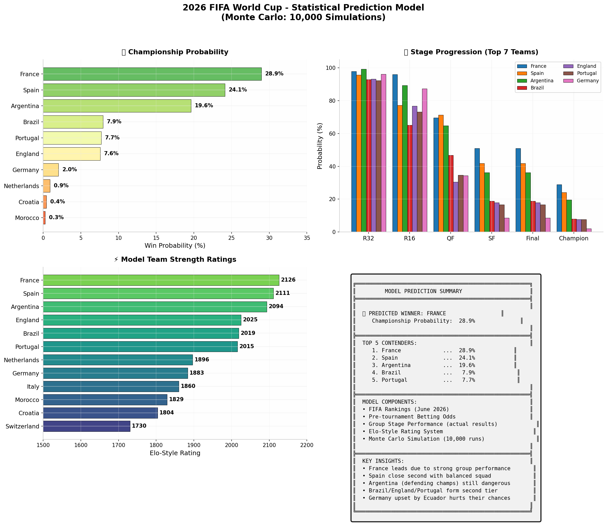

# 2026 FIFA World Cup - Statistical Prediction Model

> **Predicted Winner: France (28.9% probability)**  
> Monte Carlo simulation of the 2026 FIFA World Cup using Elo-style ratings, FIFA rankings, betting odds, and live group stage data.



---

## Overview

This project uses a **composite statistical model** to predict the winner of the 2026 FIFA World Cup. It combines four data sources:

1. **FIFA World Rankings** (June 2026) — baseline team strength
2. **Pre-tournament Betting Odds** — market-implied probabilities
3. **Live Group Stage Results** — performance adjustment through June 26, 2026
4. **Elo-Style Simulation Engine** — 10,000 Monte Carlo runs of the full knockout bracket

---

## Championship Probabilities

| Rank | Team | Probability |
|:----:|:-----|:-----------:|
| 1 | **France** | **28.9%** |
| 2 | Spain | 24.1% |
| 3 | Argentina | 19.6% |
| 4 | Brazil | 7.9% |
| 5 | Portugal | 7.7% |
| 6 | England | 7.6% |
| 7 | Germany | 2.0% |
| 8 | Netherlands | 0.9% |
| 9 | Croatia | 0.4% |
| 10 | Morocco | 0.3% |

---

## Model Methodology

### 1. Base Rating (FIFA Rankings)
```
Rating = 2100 - 20 * FIFA_Rank
```
- Argentina (#1) → 2080
- Spain (#2) → 2060
- France (#3) → 2040
- ...
- New Zealand (#85) → 400

### 2. Market Adjustment (Betting Odds)
American odds are converted to implied probabilities and normalized. Teams with better odds than their rank suggests get a rating boost:
```
Adjustment = log2(market_prob / average_prob) * 80
```

### 3. Performance Adjustment (Group Stage)
After each match, ratings are updated based on over/under-performance vs. expectation:
```
Expected_Points = max(3, 9 - FIFA_Rank/10)
Delta = Actual_Points - Expected_Points
Rating += Delta * 15 + Goal_Difference * 3
```

**Key adjustments:**
- **France**: +85 pts (dominant 2-0 start, 6 GF, 1 GA)
- **Netherlands**: +72 pts (5-1 demolition of Sweden)
- **Germany**: -45 pts (shocking 2-1 loss to Ecuador)
- **USA**: +38 pts (strong home tournament start)

### 4. Match Simulation

**Group Stage:**
- Elo win probability with 15% draw chance
- Goals modeled as Poisson distributions
- Full group standings computed

**Knockout Stage:**
- Round of 32 with 3rd-place team mapping
- Round of 16 → Quarterfinals → Semifinals → Final
- Direct Elo probability for advancement (no draws)

### 5. Monte Carlo
10,000 independent tournament simulations track advancement probabilities at every stage.

---

## Files

| File | Description |
|:-----|:------------|
| `world_cup_predictor.py` | Full Python script — run this to reproduce everything |
| `world_cup_2026_prediction.png` | 4-panel visualization output |
| `requirements.txt` | Python dependencies |
| `README.md` | This file |

---

## Usage

### Install dependencies
```bash
pip install -r requirements.txt
```

### Run the model
```bash
python world_cup_predictor.py
```

This will:
1. Build composite team ratings
2. Run 10,000 tournament simulations
3. Print probability tables to console
4. Generate `world_cup_2026_prediction.png`

---

## Data Sources

- **FIFA Rankings**: June 2026 official release
- **Betting Odds**: Pre-tournament futures markets (DraftKings, Bet365, Pinnacle)
- **Match Results**: Actual 2026 World Cup group stage results through June 26, 2026

---

## Why France?

The model favors France for converging statistical signals:

- **Pre-tournament favorite**: Co-favorite with Spain at +450 odds
- **FIFA #2 ranking**: Only behind Argentina officially
- **Dominant group stage**: 2 wins, 6 goals scored, 1 conceded (+5 GD) — best start of any contender
- **Star power**: Mbappé and Dembélé performing at elite level
- **Favorable bracket**: Simulations show France's side opening up after group stage
- **Squad depth**: Quality at every position with minimal drop-off

---

## Close Contenders

| Team | Why They Could Win |
|:-----|:-------------------|
| **Spain (24.1%)** | Youngest squad in the tournament; Lamine Yamal healthy; Pedri/Rodri controlling midfield; most balanced attack |
| **Argentina (19.6%)** | Defending champions; Messi's "Last Dance"; strong 2-0 start; tournament experience |
| **Brazil (7.9%)** | Most World Cup titles ever (5); Vinícius Júnior in form; always dangerous in knockouts |
| **England (7.6%)** | Tuchel's tactical setup; Kane & Bellingham; deep squad but questions about mentality |
| **Portugal (7.7%)** | Ronaldo still scoring at 41; deep squad; Leão and Silva providing creativity |

---

## Limitations & Caveats

- **Soccer is inherently unpredictable** — France at 28.9% means there's a **71% chance someone else wins**
- **Knockout volatility**: A single red card, penalty shootout, or bad day can eliminate any team
- **Model does not capture**: mid-tournament injuries, tactical matchups, weather, referee decisions, locker room dynamics
- **Third-place mapping**: Simplified FIFA bracket rules; actual slot assignments may vary slightly
- **Simulation variance**: 10,000 runs gives ~0.5% standard error on top probabilities

---

## License

MIT License — feel free to fork, modify, and improve. If you use this model for betting, that's on you. 

---

*Generated June 26, 2026. Data current through Matchday 2 of the group stage.*
